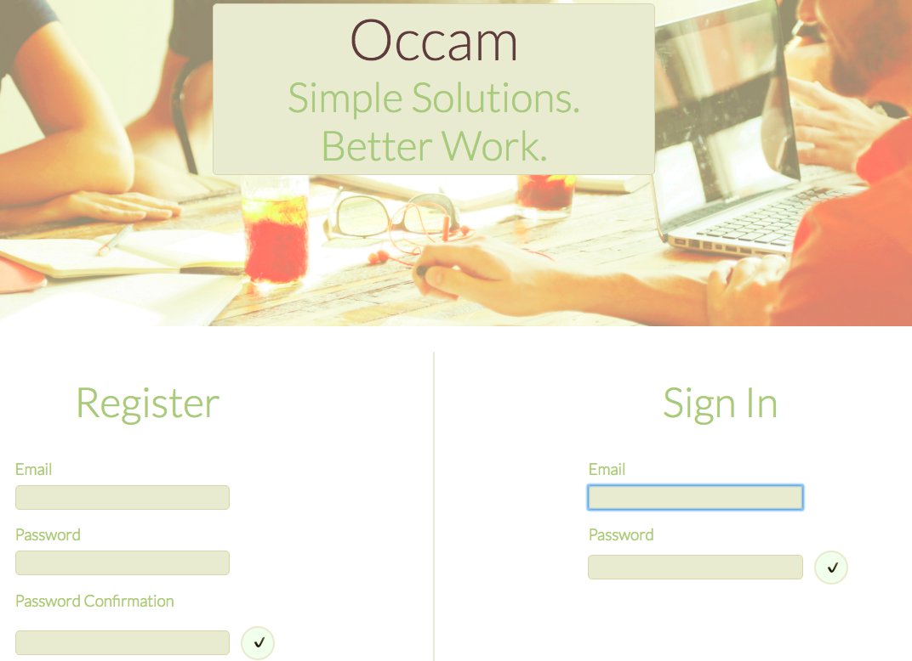
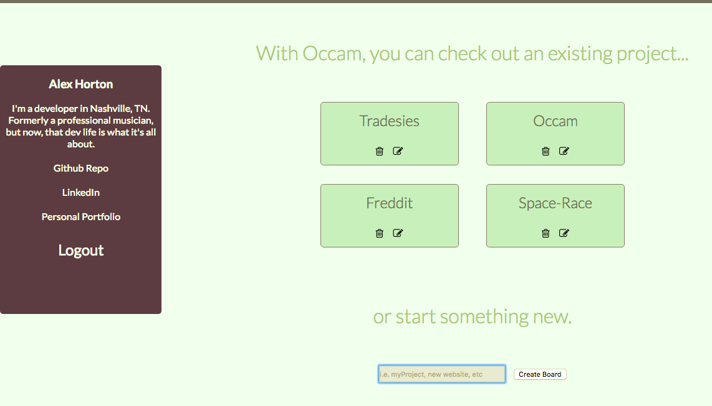
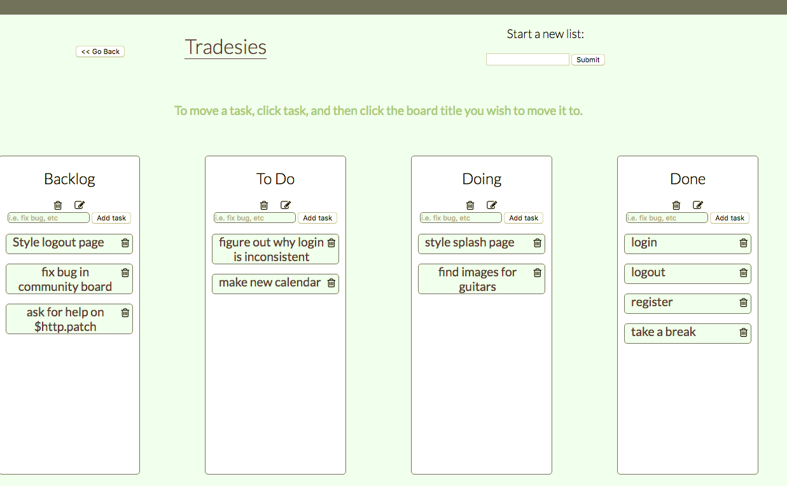

# occam
Kanban-like system with integrated chat capability.

## To install locally:
- clone
- 
  ```
  npm install
  npm run start
  redis-server
  mongod
  ```


<div>
  
</div>
</br>
<div>
  
</div>
<br>
<div>
  
</div>

## notes:
To run in the terminal, when locally installing this project:
  ```
  redis-server
  mongod
  ```
